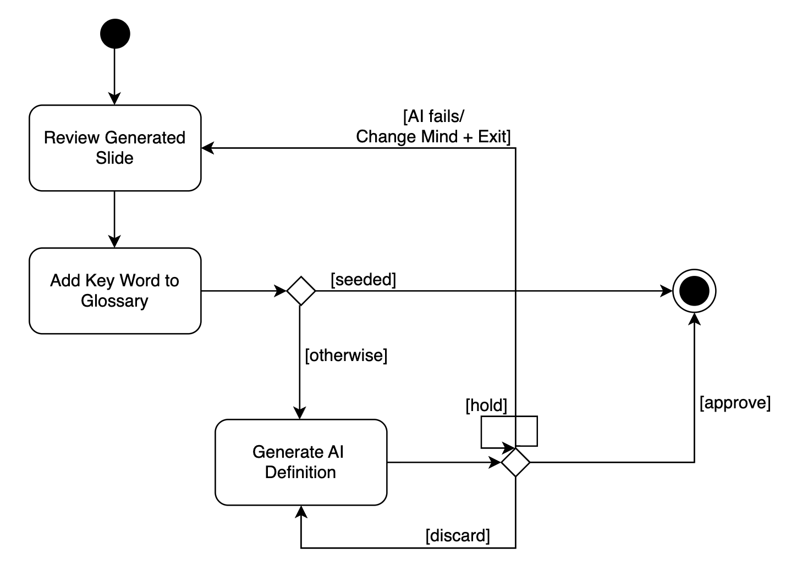
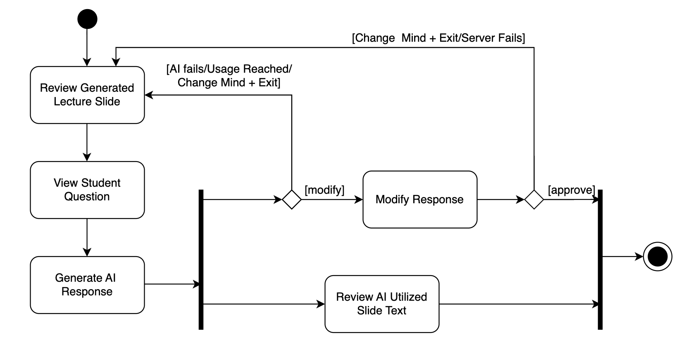
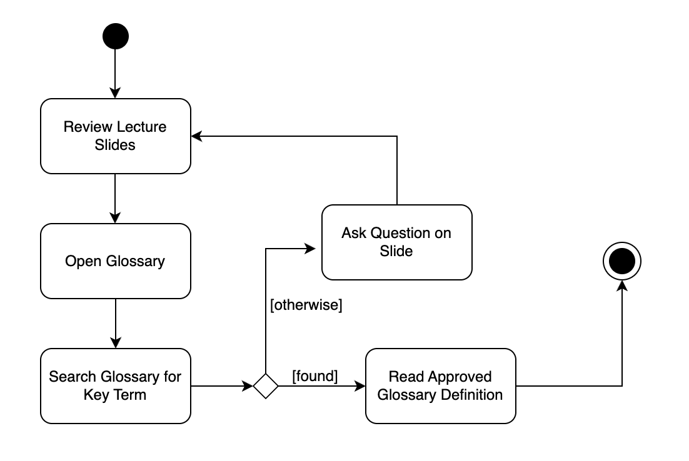
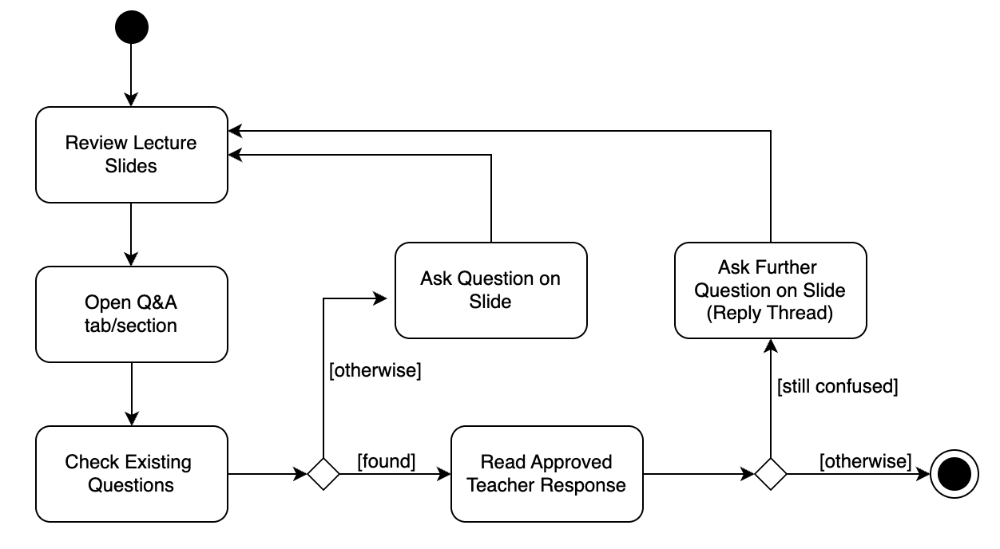

# Specification Phase Exercise

A little exercise to get started with the specification phase of the software development lifecycle. In this exercise, your team specifies a set of improvements and new features for [The Slide Machine](https://theslidemachine.com) — see the [instructions](instructions.md) for detail, and the [background](background.md) for an introduction to the software product you are tasked with extending.

## Team members
Monica Lee  https://github.com/monica9482  
Yusef Moustafa  https://github.com/YusefMoustafa  
Leslie Sampaney  https://github.com/Leslie-Sampaney  
Krishiv Seth  https://github.com/krishivseth   
Veer Singh  https://github.com/sing1179  

## Review of the Current Application
Strengths:  
- Mostly accurate transcriptions of speech onto slides  
- Navigation cue words to go forward and back a slide  
- Verbally add a picture to a given slide  
- Filler words or stutters ignored for non-strong speakers  
- AI accurately predicts and completes sentences most of the time
- Acronyms like SDLC and CI/CD came out spelled correctly, and a long stretch about waterfall versus agile became a clean two column comparison slide
- Before a quiz is published, a review screen lets the instructor edit every question and set points for each one
- Quiz settings let the instructor choose the number of questions, the question types, and add extra instructions for the AI

Weaknesses:  
- Image resource pool/must be seeded pre-lecture  
- Design template importing is not the best  
- New slide predictor doesn't allow for gaps/pauses for non-strong speakers
- Saying "next slide" mid lecture added a blank slide (slide 10) with no title or text that stayed in the finished deck
- Maintenance was said out loud but appears on none of the 12 slides, and the summary slide says six phases while the phase list slides only show five
- AI freedom defaults to 2 out of 5, so slides can include content the instructor did not say, and quizzes are written from the slide text by default with the spoken transcript as an unchecked box
- Opening a quiz link with a personal Gmail account showed "You need access" with no explanation    

Gaps:  
- Real-time verbal correction  
- Editing/approving material during the lecture  
- Unable to verbally insert diagrams/charts/graphs  
- Unable to verbally link words   
- Unable to add videos
- Signed out, the lecture page shows only the slides, a play button, and language and share icons, with no place to ask about a slide, no definitions of terms, and no mention that a quiz exists
- Quiz settings never say which accounts can open the quiz, and nothing warns the instructor before publishing
- After publishing, the Quiz tab shows only a Google Forms link, a copy button, and Delete quiz, with no open or close time and no way for students to reach it

## Prior Art & Originality

See instructions. Delete this line and replace with a short statement of what your team checked (the project's Future Work and Open Questions, its roadmap, and its open issues and pull requests) and which parts of your proposal are original — new work not already specified, scheduled, or proposed by someone else.

## Stakeholders

Students:  
**Student A — Student participant**  
Background: Student; Senior and Business.  
Interview method: Interview about study habits and proposed features, followed by app-use tasks directly observed by a team member.  
Goals and needs:  
- Understand lecture material using slides and professor-provided notes.
- Find explanations of unfamiliar terminology.
- Revisit prerequisite concepts through textbook material.
- Obtain clarification from professors, friends, office hours, or an LLM.
- Know whether an answer has been reviewed by an instructor before relying on it.

Problems and concerns:  
- Described encountering confusing slides and seeking clarification through LLMs.
- Needs to consult additional sources when terminology or prerequisite concepts are unfamiliar.
- Would not trust a classmate’s answer before professor review.
- Checks suspected errors with the professor.
- Would be uncomfortable with instructors seeing that they sought help from outside sources.

Observed app use and participant comments:  
- Selected a lecture because it seemed interesting.
- Used Google to investigate unfamiliar terminology and found sufficient, useful information.
- Successfully returning to an earlier explanation using memory.
- Said that a clarification request should include surrounding context and relevant material.

Reactions to proposed features:  
- Responded positively to an embedded glossary, particularly explanations that break down complex topics.
- Identified professor review as a condition for trusting peer answers in a slide-specific Q&A feature.  

Limitations:  
- The concept-understanding task was skipped.
- Successful Google use does not establish that external lookup is a problem.
- The participant did not test a glossary or Q&A prototype.
- Discomfort with disclosure of outside help does not establish their preference about aggregate in-app statistics.
  
**Student B — Student participant**  
Background: Student; Grad level and Industrial Engineering.  
Interview method: Interview about study habits and proposed features, followed by app-use tasks directly observed by a team member.  
Goals and needs:  
- Study using lecture slides and past exam papers.
- Obtain clarification through office hours or a teaching assistant.
- Understand unfamiliar terms and prerequisite concepts using Google or an LLM.
- Locate earlier explanations when revisiting lecture material.
- Distinguish instructor-reviewed answers from unchecked peer responses.  

Problems and concerns:  
- Described seeking help when lecture slides are confusing.
- Needs additional explanations for unfamiliar terminology and prerequisite concepts.
- Faced difficulty finding an earlier explanation in the deck.
- Would not trust a classmate’s answer before professor review.
- Would be uncomfortable with instructors seeing that they sought help from outside sources.  

Observed app use and participant comments:  
- Selected the first lecture they could find.
- Used an LLM to investigate unfamiliar terminology and found it useful.
- Had difficulty locating an earlier explanation and said they did not know where to find it.
- Said that a clarification request should include surrounding context, relevant material, and their current understanding.
- Described explaining a concept in simple words as a personal check of understanding; this ability was not demonstrated during the tasks.  

Reactions to proposed features:  
- Responded enthusiastically to the embedded glossary idea.
- Initially suggested that an answer remaining online indicated trustworthiness, but clarified that professor review would be necessary before trusting a classmate’s answer.  

Limitations:  
- The concept-understanding task was skipped.
- The specific navigation steps that led to difficulty.
- Positive reactions to the glossary do not demonstrate its effectiveness; no prototype was tested.
- Their preference concerning aggregate in-app statistics remains unknown.

Instructors and TAs:

**TA A, teaching assistant participant**

Note: TA A is a teaching assistant, not the instructor of record. We interviewed him because he answers student questions about lecture slides and reviews course material.

Background: Teaching assistant for a course that uses Ruby on Rails. Worked with about 48 to 50 students last semester and 70 this semester. The course slides come from another school's curriculum.

Interview method: Video call interview about how students ask for help, followed by app tasks done while sharing his screen from his phone, observed by a team member.

Goals and needs:
- Give students homework support, especially with Git and GitHub, such as which branch to merge into, writing pull request descriptions, and who is responsible for merging.
- Answer common setup questions quickly, such as Ruby on Rails on Windows.
- Keep lecture slides accurate, up to date, and in line with the curriculum, since students study from the slides first before exams.
- Check any AI written answer against the course textbook before it reaches students, since it is still his job to make sure it is correct.
- Prefers slides with bold definitions and bullet points over long paragraphs.
- Values student questions and would spend at least 1 to 2 hours a week on them, possibly up to 4.

Problems and concerns:
- Students often struggle with Git and GitHub. Some open pull requests with no description, and merge responsibility is confusing.
- The same questions come back semester after semester, such as Windows setup for Ruby on Rails, though they are not usually repeated within one semester.
- Students usually email first. He described their usual path as ask AI, then post on EdStem, then set up Zoom or come in person if still confused.
- Said he has never had a student ask a question that is directly on the slides or syllabus. Students come to office hours having tried other options first.
- Found slide 9 too wordy, like a small paragraph, and noted it does not mention arrange, act, assert, which is a concept he would ask about.
- Would not approve an AI drafted answer if it is generated without showing where it came from.
- Would not review student questions during class because changes to content slides have to match the curriculum.

Observed app use and participant comments:
- Found slide 9 (unit tests) in about 20 seconds by swiping through the deck on his phone.
- Asked what he would do as a student confused by slide 9 with no professor to ask, he said he would wait for a break or ask at the end. He did not mention looking for a way to ask inside the app.
- Asked how he would add a definition as the instructor, he said he would make it bold or clearly marked and use bullet points. He described this and did not try it in the app.

Reactions to proposed features:
- Student questions posted on a slide and shown only after instructor approval: called students' questions "very valuable." Would review them on his own time or during office hours, not in class.
- AI drafted answers: would approve them only if the draft shows the resource it pulls from, such as a textbook citation he could check. Said no to blind generation.

Limitations:
- One TA, not an instructor. His course slides are described as very complete, so his experience may differ in other courses.
- His statement that students do not ask about things covered on the slides gives no support to a glossary of terms.
- Not asked about the glossary, anonymous or named questions, or where questions are stored.
- Some questions were leading, such as asking if he would put a definition "straight on the slide" and whether he would review "during class."
- The task of spotting problems in the deck was not run.
- Time estimates are self reported, and he said it "depends."
- He swiped on a phone instead of using the desktop view.
- Reactions were to a spoken description, not a prototype.

**Instructor A, instructor participant**

Background: Math instructor who teaches calculus and discrete math to about 50 students.

Interview method: Interview about how students ask for help, followed by app tasks with a sample lecture deck, observed by a team member.

Goals and needs:
- Answer student questions in class, and by email when students ask outside class hours.
- Have lecture slides that students can follow without prior knowledge, with acronyms explained.
- Keep the design of the slides consistent.
- Find out earlier that students were confused instead of learning it from exam grades.
- Values student questions and would spend about an hour a week reviewing them, before and after class.
- Wants to read and edit any AI drafted answer before students see it.

Problems and concerns:
- Learns that students were confused only after the exam, from their grades.
- Students who have a question outside class hours have to email him.
- Students often ask the same questions again, semester after semester.
- Said students often search for answers themselves instead of asking.
- Said the sample deck had inconsistent fonts, a missing slide, acronyms that were not explained, and assumed prior knowledge.
- Worries an AI drafted answer might not be accurate.

Observed app use and participant comments:
- Looked through the deck and pointed out the inconsistent font, unexplained acronyms, assumed prior knowledge, and a missing slide.
- Found slide 9 (unit tests) in about 20 seconds by swiping through the slides.
- Asked what a confused student could do from the page, he said they would email him and that there is no way to ask on the screen.

Reactions to proposed features:
- Student questions posted on a slide and shown only after instructor approval: yes, he would review them because student questions are important, for about an hour a week, before and after class.
- Anonymity: would rather each student chooses whether to post anonymously or not.
- AI drafted answers: would need to read and edit them in case they are not accurate.
- Showing questions from earlier semesters: yes, because similar questions come up each time.

Limitations:
- Answers were short and some questions were not answered, such as which terms students get stuck on and what would make him not use the feature.
- The interviewer knows the participant personally.
- Reactions were to a spoken description, not a prototype.
- Time estimates are self reported.
- His experience with math courses may differ from other subjects.

## Product Vision Statement

We are adding an instructor approved glossary and slide questions to The Slide Machine so that students can get trusted help on the exact slide that confused them, with the AI drafting definitions and answers and the instructor approving, editing, holding, or discarding each one before students see it.

## User Requirements

Students
1. As a student, I want to open a course-specific definition directly from an unfamiliar term on a slide so that I can understand it while studying.
2. As a student, I want definitions to include simple explanations and examples so that complex terminology is easier to understand.
3. As a student, I want to search the glossary for a term so that I can find its meaning without remembering where it appeared.
4. As a student, I want an explanation to link to relevant prerequisite terms or earlier course material so that I can revisit background knowledge I need.
5. As a student, I want to return to my original slide after consulting an explanation so that I can continue studying without losing my place.
6. As a student, I want to find questions and answers associated with a slide so that I can check whether they address my confusion.
7. As a student, I want my question to include a reference to the slide so that the person answering can see the relevant context.
8. As a student, I want to describe what I currently understand when asking a question so that the response addresses the part I am struggling with.
9. As a student, I want to identify answers reviewed by the professor so that I know which explanations I can rely on.
10. As a student, I want to request further clarification when an explanation is insufficient so that I can resolve what remains unclear.
    
Instructors

1. As an instructor, I want the app to suggest definitions for the hard terms and acronyms in my lecture so that I don't have to write every definition myself.
2. As an instructor, I want to approve, edit, hold, or discard each suggested definition so that students only see wording I trust.
3. As an instructor, I want each suggested definition to show the slide or transcript text it came from so that I can check that it is accurate.
4. As an instructor, I want to change or remove a definition after students can see it so that I can fix a mistake quickly.
5. As an instructor, I want to see all new student questions in one list grouped by slide so that I can review them in one sitting.
6. As an instructor, I want a student question to stay hidden from other students until I approve an answer so that a wrong answer never reaches the class.
7. As an instructor, I want the app to draft an answer to a student question and show the slide text it used so that I can check it and edit it before I approve it.
8. As an instructor, I want approved questions and answers from earlier semesters to carry over to my next class with no student names so that I don't answer the same question every term.
9. As an instructor, I want to see how many questions each slide received so that I can find where students were confused before the exam.
10. As an instructor, I want a clear message when the app cannot draft an answer, for example when the AI is unavailable or my usage limit is reached, so that I know to write it myself and don't wonder what went wrong.

## Activity Diagrams

  
As an instructor, I want to approve, edit, hold, or discard each suggested definition so that students only see wording I trust.  
  
  
As an instructor, I want the app to draft an answer to a student question and show the slide text it used so that I can check it and edit it before I approve it.  
  
  
As a student, I want to search the glossary for a term so that I can find its meaning without remembering where it appeared.  
  
  
As a student, I want to find questions and answers associated with a slide so that I can check whether they address my confusion.

## Wireframes

See instructions. Delete this line and place your wireframe diagrams here, covering every new screen and every existing screen your proposal changes, for every type of user.

## Clickable Prototype

See instructions. Delete this line and place a publicly-accessible link to your clickable prototype here.

## Stakeholder Demo

See instructions. Delete this line and place a link to the deck The Slide Machine generated during your presentation here, after you have presented.

## Exit Ticket

See instructions. Delete this line and place a link to the exit-ticket quiz you generated from your demo deck and distributed to the class, along with a short note on what — if anything — you had to correct in the generated questions before publishing.
